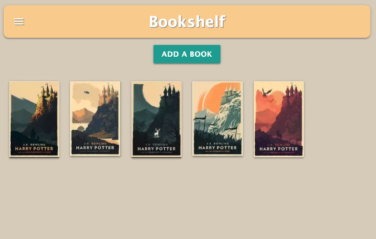

BOOKSHELF APP

This app is a way to keep track of books and a user can log in with Google. A logged in user is able to view all that have been created in an index and add, edit or delete books. Creating a book includes a Title, Author and image for a book cover. Viewing a specific book allows a logged in user to edit or delete a book and to add reviews to the book.

TECHNOLOGIES USED:
1.Javascript, HTML, CSS
2.Node.js
3.Express
4.Materialize
5.jQuery
6.Google OAuth
7.Heroku

GETTING STARTED:

1.<a href="https://jk-bookshelf.herokuapp.com/">Demo</a>

CHALLENGES:

1. OAuth failing to fetch user profile
2. Uploading images through the Add book form and creating books without images

NEXT STEPS/ICEBOX:

1. User created books/reviews
2. CRUD on Reviews
